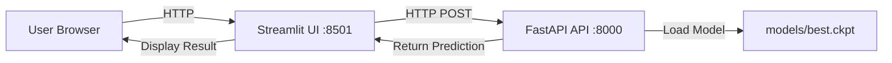

# API and UI Integration

This page describes how the API (FastAPI) and the UI (Streamlit) are integrated into the project.

## Architecture



## FastAPI Backend

### Components

#### 1. Model Loading

```python
# src/mbti_classifier/api.py
from src.mbti_classifier.model import MBTIClassifier

# Load model at startup
classifier = MBTIClassifier.load_from_checkpoint('models/best.ckpt')
```

**Features:**
- Loads the model **only once** at startup
- Keeps the model in memory for fast inference
- Uses the best checkpoint saved during training

#### 2. Endpoints

##### Health Check

```python
@app.get("/health")
def health():
    """Checks that the API is running."""
    return {"status": "healthy"}
```

**Usage:**

```bash
curl http://localhost:8000/health
# {"status": "healthy"}
```

##### Single Prediction

```python
@app.post("/predict")
def predict(request: PredictRequest):
    """Predicts the MBTI type of a text."""
    mbti_type = classifier.predict(request.text)
    probs = classifier.predict_proba(request.text)
    
    return {
        "mbti_type": mbti_type,
        "probabilities": {
            "E_I": float(probs[0]),
            "S_N": float(probs[1]),
            "T_F": float(probs[2]),
            "J_P": float(probs[3])
        }
    }
```

**Request:**

```json
{
  "text": "I love analyzing complex problems and finding patterns."
}
```

**Response:**

```json
{
  "mbti_type": "INTP",
  "probabilities": {
    "E_I": 0.15,
    "S_N": 0.23,
    "T_F": 0.82,
    "J_P": 0.38
  }
}
```

##### Batch Prediction

```python
@app.post("/predict_batch")
def predict_batch(request: PredictBatchRequest):
    """Predicts MBTI types for multiple texts."""
    predictions = []
    for text in request.texts:
        mbti_type = classifier.predict(text)
        probs = classifier.predict_proba(text)
        predictions.append({
            "text": text,
            "mbti_type": mbti_type,
            "probabilities": {...}
        })
    return {"predictions": predictions}
```

### Pydantic Models

```python
from pydantic import BaseModel, Field

class PredictRequest(BaseModel):
    text: str = Field(..., min_length=1, description="Text to classify")

class PredictBatchRequest(BaseModel):
    texts: list[str] = Field(..., min_items=1, max_items=100)
```

**Automatic validation:**
- `text` cannot be empty
- `texts` must have 1-100 items
- Returns HTTP 422 if validation fails

### CORS

```python
from fastapi.middleware.cors import CORSMiddleware

app.add_middleware(
    CORSMiddleware,
    allow_origins=["*"],  # Allow all origins
    allow_credentials=True,
    allow_methods=["*"],
    allow_headers=["*"],
)
```

**Allows:**
- Requests from any domain
- Necessary for Streamlit (port 8501) to access API (port 8000)

## Streamlit Frontend

### Components

#### 1. Configuration

```python
# src/mbti_classifier/ui.py
import streamlit as st
import os

# API URL
API_URL = os.getenv("API_URL", "http://localhost:8000")

# Configure page
st.set_page_config(
    page_title="MBTI Classifier",
    page_icon="🧠",
    layout="wide"
)
```

**Environment Variables:**
- **Local**: `API_URL=http://localhost:8000`
- **Docker**: `API_URL=http://api:8000` (uses service name)

#### 2. UI Layout

```python
# Header
st.title("🧠 MBTI Personality Classifier")
st.markdown("Predict your personality type based on text.")

# Input
text = st.text_area(
    "Enter text:",
    placeholder="Write something about yourself...",
    height=150
)

# Button
if st.button("Classify", type="primary"):
    # Call API
    ...
```

#### 3. API Call

```python
import requests

def predict(text: str) -> dict:
    """Calls the API to predict."""
    try:
        response = requests.post(
            f"{API_URL}/predict",
            json={"text": text},
            timeout=10
        )
        response.raise_for_status()
        return response.json()
    except requests.exceptions.RequestException as e:
        st.error(f"Error connecting to the API: {e}")
        return None
```

#### 4. Result Visualization

```python
# Show MBTI type
st.success(f"Your personality type is: **{result['mbti_type']}**")

# Show probabilities
probs = result['probabilities']

col1, col2, col3, col4 = st.columns(4)
with col1:
    st.metric("E/I", f"{probs['E_I']:.0%}", 
              "E" if probs['E_I'] > 0.5 else "I")
with col2:
    st.metric("S/N", f"{probs['S_N']:.0%}",
              "S" if probs['S_N'] > 0.5 else "N")
# ...

# Progress bars
st.progress(probs['E_I'], text="Extraversion")
st.progress(probs['S_N'], text="Sensing")
# ...
```

## Service Communication

### Local Development

```bash
# Terminal 1: API
uv run python src/mbti_classifier/api.py
# Running on http://localhost:8000

# Terminal 2: UI
uv run python src/mbti_classifier/ui.py
# Running on http://localhost:8501
```

**Flow:**
1. User opens `http://localhost:8501`
2. Streamlit runs in browser
3. User enters text and clicks "Classify"
4. Streamlit sends POST to `http://localhost:8000/predict`
5. FastAPI processes and returns result
6. Streamlit displays result

### Docker (Production)

```yaml
# docker-compose.yaml
services:
  api:
    build:
      context: .
      dockerfile: dockerfiles/api.dockerfile
    ports:
      - "8000:8000"
    healthcheck:
      test: ["CMD", "curl", "-f", "http://localhost:8000/health"]
      interval: 10s
      timeout: 5s
      retries: 5
      start_period: 120s
  
  ui:
    build:
      context: .
      dockerfile: dockerfiles/ui.dockerfile
    ports:
      - "8501:8501"
    environment:
      - API_URL=http://api:8000  # Uses service name
    depends_on:
      api:
        condition: service_healthy
```

**Key differences:**
- **Networking**: Docker Compose creates an internal network
- **Service Discovery**: UI accesses API via `http://api:8000` (service name)
- **Healthcheck**: UI waits for API to be healthy before starting
- **Isolation**: Each service in its own container

## Error Handling

### API

```python
from fastapi import HTTPException

@app.post("/predict")
def predict(request: PredictRequest):
    try:
        mbti_type = classifier.predict(request.text)
        return {"mbti_type": mbti_type, ...}
    except Exception as e:
        raise HTTPException(
            status_code=500,
            detail=f"Prediction error: {str(e)}"
        )
```

### UI

```python
try:
    response = requests.post(f"{API_URL}/predict", json={"text": text})
    response.raise_for_status()
    result = response.json()
except requests.exceptions.ConnectionError:
    st.error("❌ Cannot connect to API. Is it running?")
except requests.exceptions.Timeout:
    st.error("⏱️ The API took too long to respond.")
except requests.exceptions.HTTPError as e:
    st.error(f"❌ HTTP Error: {e.response.status_code}")
except Exception as e:
    st.error(f"❌ Unexpected error: {str(e)}")
```

## Testing

### API Tests

```python
# tests/unit/test_api.py
from fastapi.testclient import TestClient
from src.mbti_classifier.api import app

client = TestClient(app)

def test_health():
    response = client.get("/health")
    assert response.status_code == 200
    assert response.json() == {"status": "healthy"}

def test_predict():
    response = client.post(
        "/predict",
        json={"text": "I love solving complex problems."}
    )
    assert response.status_code == 200
    data = response.json()
    assert "mbti_type" in data
    assert len(data["mbti_type"]) == 4
```

### UI Tests

```python
# tests/integration/test_ui.py
import requests

def test_ui_api_integration():
    """Test that UI can communicate with API."""
    # Assume API is running
    API_URL = "http://localhost:8000"
    
    # Call API as UI does
    response = requests.post(
        f"{API_URL}/predict",
        json={"text": "Test text"}
    )
    
    assert response.status_code == 200
    assert "mbti_type" in response.json()
```

## Deployment

### Local

```bash
# Terminal 1
uv run invoke api

# Terminal 2
uv run invoke ui
```

### Docker

```bash
# Build
uv run invoke docker-build

# Start services
uv run invoke docker-up

# Check logs
uv run invoke docker-logs --service=api
uv run invoke docker-logs --service=ui

# Stop
uv run invoke docker-down
```

### Cloud (example with Fly.io)

```bash
# API
fly launch --dockerfile=dockerfiles/api.dockerfile --name mbti-api

# UI
fly launch --dockerfile=dockerfiles/ui.dockerfile --name mbti-ui \
    --env API_URL=[https://mbti-api.fly.dev](https://mbti-api.fly.dev)
```

## Monitoring

### API Metrics

FastAPI provides automatic metrics at `/docs`:

```
http://localhost:8000/docs
```

**Useful metrics:**
- Requests per second
- Average latency
- 4xx/5xx errors

### UI Analytics

Streamlit Cloud provides automatic analytics:

```python
# Optional: add Google Analytics
st.markdown("""
<script async src="[https://www.googletagmanager.com/gtag/js?id=GA_ID](https://www.googletagmanager.com/gtag/js?id=GA_ID)"></script>
""", unsafe_allow_html=True)
```

## Performance

### API Optimization

```python
# 1. Batch predictions (more efficient)
@app.post("/predict_batch")
def predict_batch(request: PredictBatchRequest):
    # Process in batch instead of one by one
    texts = request.texts
    predictions = classifier.predict_batch(texts)  # Vectorized
    return {"predictions": predictions}

# 2. Caching (for repeated requests)
from functools import lru_cache

@lru_cache(maxsize=128)
def cached_predict(text: str) -> str:
    return classifier.predict(text)
```

### UI Optimization

```python
# 1. Cache in Streamlit
@st.cache_data
def load_data():
    # Data that doesn't change
    return ...

# 2. Session state (avoid recomputation)
if "result" not in st.session_state:
    st.session_state.result = None
```

## Security

### API

```python
# 1. Rate limiting (requires slowapi)
from slowapi import Limiter
from slowapi.util import get_remote_address

limiter = Limiter(key_func=get_remote_address)
app.state.limiter = limiter

@app.post("/predict")
@limiter.limit("100/minute")
def predict(request: PredictRequest):
    ...

# 2. API Key authentication
from fastapi import Header, HTTPException

async def verify_api_key(x_api_key: str = Header()):
    if x_api_key != os.getenv("API_KEY"):
        raise HTTPException(status_code=401, detail="Invalid API key")

@app.post("/predict", dependencies=[Depends(verify_api_key)])
def predict(request: PredictRequest):
    ...
```

### UI

```python
# Input sanitization
import html

def sanitize_input(text: str) -> str:
    """Sanitize user input."""
    return html.escape(text)

# Usage:
safe_text = sanitize_input(user_input)
result = predict(safe_text)
```

## Troubleshooting

### UI cannot connect to API

**Problem:**
```
Error connecting to the API: Connection refused
```

**Solutions:**

```bash
# 1. Verify that API is running
curl http://localhost:8000/health

# 2. Verify API_URL in UI
# In ui.py:
API_URL = os.getenv("API_URL", "http://localhost:8000")

# 3. In Docker, verify networking
docker compose logs api
docker compose exec ui ping api
```

### API returns 500

**Problem:**
```json
{"detail": "Internal Server Error"}
```

**Solutions:**

```bash
# 1. Check API logs
docker compose logs api

# 2. Verify model exists
ls -lh models/best.ckpt

# 3. Direct test
curl -X POST http://localhost:8000/predict \
  -H "Content-Type: application/json" \
  -d '{"text": "test"}'
```

### Prediction is very slow

**Problem:**
Each prediction takes >10 seconds

**Solutions:**

```python
# 1. Move model to GPU (in api.py)
import torch
classifier = classifier.to('cuda' if torch.cuda.is_available() else 'cpu')

# 2. Use batch prediction
# Accumulate requests and process in batch

# 3. Reduce max_length
# In MBTIClassifier, tokenize with max_length=256 instead of 512
```

## References

- [FastAPI Documentation](https://fastapi.tiangolo.com/)
- [Streamlit Documentation](https://docs.streamlit.io/)
- [Docker Compose Networking](https://docs.docker.com/compose/networking/)
- [API Development](../api/api.md)
- [UI Development](../api/ui.md)