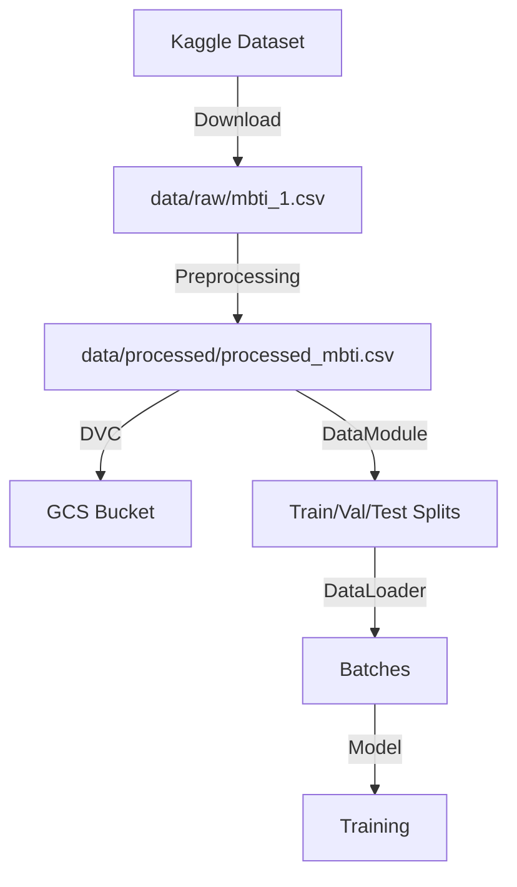

# Data Pipeline

This page describes the complete data flow from download to processing and loading into the model.

## Overview



## Pipeline Stages

### 1. Data Download

Data is automatically downloaded from Kaggle if it doesn't exist:

```python
from src.mbti_classifier.data import download_mbti_data

# Downloads to data/raw/mbti_1.csv
download_mbti_data()
```

**Original Dataset:**
- **Source**: [Kaggle MBTI Dataset](https://www.kaggle.com/datasnaek/mbti-type)
- **Format**: CSV with `type` and `posts` columns
- **Size**: ~8,600 users
- **Content**: `posts` contains 50 posts separated by `|||`

### 2. Preprocessing

The `preprocess_mbti_data()` function performs the following transformations:

```python
def preprocess_mbti_data(
    raw_data_path: str = "data/raw/mbti_1.csv",
    processed_data_path: str = "data/processed/processed_mbti.csv"
) -> pd.DataFrame:
    # 1. Read data
    # 2. Split MBTI into binary dimensions
    # 3. Split posts (50 posts → 1 per row)
    # 4. Clean text
    # 5. Save result
```

#### 2.1 MBTI Dimension Separation

The 4-letter MBTI type is converted into 4 binary labels:

| MBTI Type | E/I | S/N | T/F | J/P |
|-----------|-----|-----|-----|-----|
| INTJ      | 0   | 0   | 1   | 0   |
| ENFP      | 1   | 0   | 0   | 1   |
| ISTP      | 0   | 1   | 1   | 1   |

```python
df['E_I'] = df['type'].str[0].map({'E': 1, 'I': 0})
df['S_N'] = df['type'].str[1].map({'S': 1, 'N': 0})
df['T_F'] = df['type'].str[2].map({'T': 1, 'F': 0})
df['J_P'] = df['type'].str[3].map({'J': 1, 'P': 0})
```

#### 2.2 Post Separation

Each user has 50 concatenated posts. They are separated to have 1 post per row:

```python
# Before: 1 row with 50 posts
"Hello world|||How are you?|||Great day!"

# After: 3 rows (1 post each)
"Hello world"
"How are you?"
"Great day!"
```

This increases the dataset from ~8,600 rows to ~430,000 rows.

#### 2.3 Text Cleaning

The following transformations are applied:

```python
def clean_text(text: str) -> str:
    # 1. Convert to lowercase
    text = text.lower()
    
    # 2. Remove URLs
    text = re.sub(r'http\S+|www\S+', '', text)
    
    # 3. Remove @username mentions
    text = re.sub(r'@\w+', '', text)
    
    # 4. Remove emojis and special characters
    text = re.sub(r'[^\w\s]', ' ', text)
    
    # 5. Normalize spaces
    text = re.sub(r'\s+', ' ', text).strip()
    
    return text
```

### 3. Storage with DVC

Preprocessed data is versioned with DVC:

```bash
# Add to DVC
uv run dvc add data/processed

# Upload to GCS
uv run dvc push
```

This creates `data/processed.dvc` with the file hash:

```yaml
outs:
- md5: a1b2c3d4e5f6...
  size: 45678901
  hash: md5
  path: processed
```

### 4. Data Loading (DataModule)

The `MBTIDataModule` manages data loading and splitting:

```python
class MBTIDataModule(pl.LightningDataModule):
    def prepare_data(self):
        # Download and preprocess if it doesn't exist
        if not os.path.exists(self.processed_data_path):
            download_mbti_data(self.raw_data_path)
            preprocess_mbti_data(self.raw_data_path, self.processed_data_path)
    
    def setup(self, stage: str):
        # Load preprocessed data
        df = pd.read_csv(self.processed_data_path)
        
        # Split train/val/test (80/10/10)
        train_df, temp_df = train_test_split(df, test_size=0.2)
        val_df, test_df = train_test_split(temp_df, test_size=0.5)
        
        # Create datasets
        self.train_dataset = MBTIDataset(train_df, self.tokenizer, self.max_length)
        self.val_dataset = MBTIDataset(val_df, self.tokenizer, self.max_length)
        self.test_dataset = MBTIDataset(test_df, self.tokenizer, self.max_length)
```

### 5. Dataset and Tokenization

The `MBTIDataset` implements window sampling:

```python
class MBTIDataset(Dataset):
    def __getitem__(self, idx: int):
        # Get post
        text = self.data.iloc[idx]['posts']
        
        # Tokenize WITHOUT truncation
        tokens = self.tokenizer(text, truncation=False, add_special_tokens=False)
        
        # If too long, take random window
        if len(tokens['input_ids']) > self.max_length - 2:
            start_idx = random.randint(0, len(tokens['input_ids']) - (self.max_length - 2))
            tokens['input_ids'] = tokens['input_ids'][start_idx:start_idx + self.max_length - 2]
            tokens['attention_mask'] = tokens['attention_mask'][start_idx:start_idx + self.max_length - 2]
        
        # Add [CLS] and [SEP]
        input_ids = [self.tokenizer.cls_token_id] + tokens['input_ids'] + [self.tokenizer.sep_token_id]
        attention_mask = [1] + tokens['attention_mask'] + [1]
        
        # Padding if necessary
        if len(input_ids) < self.max_length:
            padding_length = self.max_length - len(input_ids)
            input_ids += [self.tokenizer.pad_token_id] * padding_length
            attention_mask += [0] * padding_length
        
        return {
            'input_ids': torch.tensor(input_ids),
            'attention_mask': torch.tensor(attention_mask),
            'labels': torch.tensor([
                self.data.iloc[idx]['E_I'],
                self.data.iloc[idx]['S_N'],
                self.data.iloc[idx]['T_F'],
                self.data.iloc[idx]['J_P']
            ])
        }
```

**Advantages of Random Sampling:**
- Avoids losing information from long posts
- Increases training variability
- Improves generalization

### 6. DataLoaders

The `DataModule` creates the dataloaders:

```python
def train_dataloader(self):
    return DataLoader(
        self.train_dataset,
        batch_size=self.batch_size,
        shuffle=True,  # Important for training
        num_workers=self.num_workers,
        pin_memory=True  # Speeds up GPU transfer
    )

def val_dataloader(self):
    return DataLoader(
        self.val_dataset,
        batch_size=self.batch_size,
        shuffle=False,  # Not needed for validation
        num_workers=self.num_workers,
        pin_memory=True
    )
```

## Configuration

Pipeline configuration is found in `configs/data/default.yaml`:

```yaml
_target_: src.mbti_classifier.data.MBTIDataModule
raw_data_path: data/raw/mbti_1.csv
processed_data_path: data/processed/processed_mbti.csv
batch_size: 16
max_length: 512
num_workers: 4
```

## Cache and Performance

### Cache System

The pipeline implements caching at two levels:

1. **Preprocessing Cache:**
   ```python
   if not os.path.exists(processed_data_path):
       # Only preprocess if it doesn't exist
       preprocess_mbti_data(raw_data_path, processed_data_path)
   ```

2. **DVC Cache:**
   ```bash
   # First download from GCS
   uv run dvc pull  # Slow (~800MB)
   
   # Subsequent uses
   uv run dvc pull  # Instant if no changes
   ```

### Optimizations

- **num_workers**: Parallelizes data loading (4 workers by default)
- **pin_memory**: Speeds up CPU → GPU transfer
- **shuffle**: Only in train, saves time in val/test
- **Random window**: Avoids recomputing the entire sequence

## Complete Example Flow

```python
# 1. Preparation (one time only)
python -c "from src.mbti_classifier.data import download_mbti_data, preprocess_mbti_data; download_mbti_data(); preprocess_mbti_data()"

# 2. Version with DVC
uv run dvc add data/raw data/processed
uv run dvc push

# 3. In another environment
uv run dvc pull  # Download preprocessed data

# 4. Train
uv run python src/mbti_classifier/train.py

# The DataModule handles:
# - Verifying data exists
# - Downloading if it doesn't exist
# - Preprocessing if not already processed
# - Creating train/val/test splits
# - Creating dataloaders
# - Tokenization and batching
```

## Monitoring

### Dataset Statistics

```python
import pandas as pd

df = pd.read_csv('data/processed/processed_mbti.csv')

print(f"Total posts: {len(df)}")
print(f"Distribution by dimension:")
print(f"  E/I: {df['E_I'].mean():.2%} extroverts")
print(f"  S/N: {df['S_N'].mean():.2%} sensing")
print(f"  T/F: {df['T_F'].mean():.2%} thinking")
print(f"  J/P: {df['J_P'].mean():.2%} judging")
print(f"Average length: {df['posts'].str.len().mean():.0f} chars")
```

### Data Validation

The pipeline includes automatic validations:

```python
# In MBTIDataModule.setup()
assert not df.isnull().any().any(), "Data contains NaN"
assert all(df[col].isin([0, 1]) for col in ['E_I', 'S_N', 'T_F', 'J_P']), "Labels out of range"
assert len(df) > 0, "Empty dataset"
```

## Troubleshooting

### Problem: Data doesn't download

**Solution:**
```bash
# Download manually from Kaggle
kaggle datasets download -d datasnaek/mbti-type
unzip mbti-type.zip -d data/raw/

# Or use DVC
uv run dvc pull
```

### Problem: Slow preprocessing

**Solution:**
```python
# Use fewer posts per user
df_sample = df.groupby('type').sample(n=10)  # 10 posts instead of 50
```

### Problem: Out of memory in DataLoader

**Solution:**
```yaml
# In configs/data/default.yaml
batch_size: 8  # Reduce from 16
num_workers: 2  # Reduce from 4
```

## References

- [Hydra Configuration](../configuration/hydra.md)
- [Data Configuration](../configuration/data.md)
- [DVC Workflow](../development/dvc.md)
