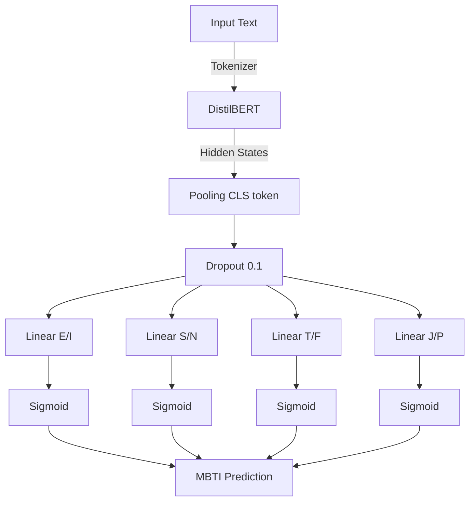

# Model Architecture

This page describes the architecture of the MBTI classification model based on DistilBERT.

## Overview

The model uses a **multi-task binary classification** approach instead of 16-class classification:



## Why Multi-Task?

### Issue with 16 Classes

Direct classification of 16 MBTI types has issues:

```python
# 16-class Classification
# Problem 1: Extreme imbalance
INTJ: 2000 samples
ESFP: 50 samples  # 40x less!

# Problem 2: Incorrect predictions are equally bad
Prediction: INTJ
Actual:     INTP
# Only 1 dimension wrong, but loss is the same as if all were wrong
```

### Solution: 4 Binary Classifiers

```python
# Multi-task binary classification
# Advantage 1: More uniform balance
E/I: 45% vs 55%
S/N: 25% vs 75%
T/F: 53% vs 47%
J/P: 48% vs 52%

# Advantage 2: Loss proportional to error
Prediction: I=1, N=1, T=0, J=1  → INFJ
Actual:     I=1, N=1, T=1, P=1  → INTP
# Loss only penalizes the 2 incorrect dimensions (T/F and J/P)
```

## Model Components

### 1. Encoder: DistilBERT

**DistilBERT** is a distilled version of BERT:

| Feature        | BERT-base | DistilBERT |
|----------------|-----------|------------|
| Parameters     | 110M      | 66M        |
| Layers         | 12        | 6          |
| Speed          | 1x        | 2x         |
| Memory         | 1x        | 0.6x       |
| Performance    | 100%      | 97%        |

```python
from transformers import DistilBertModel

encoder = DistilBertModel.from_pretrained('distilbert-base-uncased')
# 6 transformer layers
# 768 hidden dimensions
# 12 attention heads per layer
```

**Advantages:**
- ✅ Faster than BERT
- ✅ Less memory (fits on small GPUs)
- ✅ Retains 97% of BERT's performance
- ✅ Trained on 60GB of English text

### 2. Pooling: [CLS] Token

The special [CLS] token is used as the sequence representation:

```python
# Input: [CLS] Hello world [SEP] [PAD] [PAD]
# Tokens:  0     1     2      3     4     5

# DistilBERT output
outputs = encoder(input_ids, attention_mask)
# Shape: (batch_size, seq_len, 768)

# Extract [CLS] token (first position)
cls_output = outputs.last_hidden_state[:, 0, :]
# Shape: (batch_size, 768)
```

**Why [CLS] and not mean pooling?**

```python
# [CLS] Pooling (used in this project)
cls = outputs.last_hidden_state[:, 0, :]  # Only first position

# Mean Pooling (alternative)
mean = (outputs.last_hidden_state * attention_mask.unsqueeze(-1)).sum(1)
mean = mean / attention_mask.sum(1).unsqueeze(-1)
```

**Advantages of [CLS]:**
- Specifically trained to represent the entire sequence
- Faster (no averaging required)
- Standard in BERT-based classification

### 3. Dropout: Regularization

```python
dropout = nn.Dropout(p=0.1)
# With probability 0.1, sets each neuron to 0
# Scales the others by 1/(1-0.1) = 1.11
```

**Effect:**
```python
# Without dropout (overfitting)
x = [1.0, 2.0, 3.0, 4.0]

# With dropout (training)
x = [0.0, 2.22, 3.33, 0.0]  # 2 neurons turned off randomly

# During inference: dropout is disabled
x = [1.0, 2.0, 3.0, 4.0]
```

**Prevents:**
- Overfitting
- Co-adaptation of neurons
- Improves generalization

### 4. Classification Heads: 4 Binaries

Each MBTI dimension has its own classification layer:

```python
self.classifiers = nn.ModuleList([
    nn.Linear(768, 1),  # E/I
    nn.Linear(768, 1),  # S/N
    nn.Linear(768, 1),  # T/F
    nn.Linear(768, 1)   # J/P
])
```

**Forward pass:**

```python
def forward(self, input_ids, attention_mask):
    # 1. Encoder
    outputs = self.encoder(input_ids, attention_mask)
    
    # 2. Pooling
    cls_output = outputs.last_hidden_state[:, 0, :]
    
    # 3. Dropout
    cls_output = self.dropout(cls_output)
    
    # 4. Classification (4 independent classifiers)
    logits = [classifier(cls_output) for classifier in self.classifiers]
    logits = torch.cat(logits, dim=1)  # Shape: (batch, 4)
    
    # 5. Sigmoid
    probs = torch.sigmoid(logits)
    
    return probs
```

## Training Details

### Loss Function: Binary Cross-Entropy

```python
criterion = nn.BCEWithLogitsLoss()

# For each dimension
for i in range(4):
    loss_i = -[y_i * log(p_i) + (1-y_i) * log(1-p_i)]

# Total loss = average of the 4 dimensions
total_loss = mean(loss_0, loss_1, loss_2, loss_3)
```

**Example:**

```python
# Prediction: [0.8, 0.6, 0.4, 0.7]  (E, N, F, J)
# Actual:     [1,   1,   0,   1  ]  (E, N, F, J)

# Loss per dimension:
# E/I: -(1*log(0.8) + 0*log(0.2)) = 0.22
# S/N: -(1*log(0.6) + 0*log(0.4)) = 0.51
# T/F: -(0*log(0.4) + 1*log(0.6)) = 0.51
# J/P: -(1*log(0.7) + 0*log(0.3)) = 0.36

# Total: (0.22 + 0.51 + 0.51 + 0.36) / 4 = 0.40
```

### Optimizer: AdamW

```python
optimizer = torch.optim.AdamW(
    model.parameters(),
    lr=2e-5,  # Small learning rate for fine-tuning
    weight_decay=0.01  # L2 regularization
)
```

**Important Parameters:**
- **lr=2e-5**: Lower than training from scratch (typically 1e-3)
- **weight_decay**: Prevents very large weights

### Learning Rate Scheduler

```python
from transformers import get_linear_schedule_with_warmup

scheduler = get_linear_schedule_with_warmup(
    optimizer,
    num_warmup_steps=500,  # Warmup for 500 steps
    num_training_steps=total_steps
)
```

**Effect:**

```
Learning Rate
    |
2e-5|     ________
    |    /         \
    |   /           \___
    |  /                \___
 0  |_____________________\___
    0   500            total_steps
       warmup
```

**Advantages:**
- Warmup avoids large gradients at the start
- Decay improves convergence at the end

### Metrics

4 accuracies (one per dimension) + total accuracy are calculated:

```python
def compute_metrics(predictions, labels):
    # Binary predictions
    preds = (predictions > 0.5).float()
    
    # Accuracy per dimension
    acc_ei = (preds[:, 0] == labels[:, 0]).float().mean()
    acc_sn = (preds[:, 1] == labels[:, 1]).float().mean()
    acc_tf = (preds[:, 2] == labels[:, 2]).float().mean()
    acc_jp = (preds[:, 3] == labels[:, 3]).float().mean()
    
    # Total accuracy (all dimensions correct)
    acc_total = (preds == labels).all(dim=1).float().mean()
    
    return {
        'acc_ei': acc_ei,
        'acc_sn': acc_sn,
        'acc_tf': acc_tf,
        'acc_jp': acc_jp,
        'acc_total': acc_total
    }
```

**Example:**

```python
# Predictions: [[1, 1, 0, 1],   # ENFJ predicted
#               [0, 1, 1, 0]]   # INTP predicted

# Labels:      [[1, 1, 0, 1],   # ENFJ actual ✓
#               [0, 1, 1, 1]]   # INTJ actual (J/P incorrect)

# Results:
acc_ei = 2/2 = 1.00  # Both correct
acc_sn = 2/2 = 1.00
acc_tf = 2/2 = 1.00
acc_jp = 1/2 = 0.50  # Second one incorrect
acc_total = 1/2 = 0.50  # Only first one completely correct
```

## Model Variants

### 1. Default Model

```yaml
# configs/model/default.yaml
_target_: src.mbti_classifier.model.MBTIModel
model_name: distilbert-base-uncased
learning_rate: 2e-5
dropout_rate: 0.1
weight_decay: 0.01
```

**Usage:**
```bash
uv run python src/mbti_classifier/train.py
```

### 2. Quick Model (for testing)

```yaml
# configs/model/quick.yaml
_target_: src.mbti_classifier.model.MBTIModel
model_name: distilbert-base-uncased
learning_rate: 5e-5  # Higher for faster convergence
dropout_rate: 0.1
weight_decay: 0.01
```

**Usage:**
```bash
uv run python src/mbti_classifier/train.py model=quick trainer=quick
# Trains quickly (1 epoch) to validate pipeline
```

## Inference

### Simple Prediction

```python
from src.mbti_classifier.model import MBTIClassifier

# Load model
classifier = MBTIClassifier.load_from_checkpoint('models/best.ckpt')

# Predict
mbti_type = classifier.predict("I love analyzing complex problems...")
print(mbti_type)  # Output: "INTJ"
```

### Batch Prediction

```python
texts = [
    "I love meeting new people!",
    "I prefer staying home and reading",
    "Logic above all else"
]

predictions = [classifier.predict(text) for text in texts]
# Output: ["ENFP", "INFP", "INTP"]
```

### With Probabilities

```python
probs = classifier.predict_proba(text)
# Output: tensor([0.85, 0.62, 0.78, 0.55])
#         (E=0.85, N=0.62, T=0.78, J=0.55)

# Convert to types
mbti = ""
mbti += "E" if probs[0] > 0.5 else "I"
mbti += "N" if probs[1] > 0.5 else "S"
mbti += "T" if probs[2] > 0.5 else "F"
mbti += "J" if probs[3] > 0.5 else "P"
# Output: "ENTJ"
```

## Advanced Topics

### Fine-Tuning Strategy

The model uses **fine-tuning** of pre-trained DistilBERT:

```python
# Option 1: Fine-tune all layers (currently used)
for param in model.encoder.parameters():
    param.requires_grad = True

# Option 2: Freeze encoder, train classifiers only
for param in model.encoder.parameters():
    param.requires_grad = False
for classifier in model.classifiers:
    for param in classifier.parameters():
        param.requires_grad = True

# Option 3: Gradual unfreezing
# Epoch 1: Classifiers only
# Epoch 2: Last DistilBERT layer + classifiers
# Epoch 3: All layers
```

### Gradient Accumulation

To train with a larger effective batch size:

```yaml
# configs/trainer/default.yaml
accumulate_grad_batches: 4  # Effective batch = 16 * 4 = 64
```

```python
# Equivalent to:
for i, batch in enumerate(dataloader):
    loss = model(batch)
    loss = loss / 4  # Scale loss
    loss.backward()
    
    if (i + 1) % 4 == 0:
        optimizer.step()
        optimizer.zero_grad()
```

### Mixed Precision Training

Reduces memory and speeds up training:

```yaml
# configs/trainer/default.yaml
precision: 16-mixed  # Uses float16 for calculations, float32 for weights
```

**Advantages:**
- 50% less memory
- 2-3x faster on modern GPUs
- No loss of precision thanks to loss scaling

## Model Size and Performance

| Component  | Parameters | Memory |
|------------|-----------|---------|
| DistilBERT | 66M       | 250 MB  |
| 4x Linear  | 3072      | 12 KB   |
| **Total** | **66M** | **250 MB** |

**Training:**
- GPU Memory: ~4 GB (batch_size=16)
- Training Time: ~2h on V100 (10 epochs)
- Inference: ~50ms per text on CPU

## Troubleshooting

### Problem: Overfitting

**Symptoms:**
```
Train Acc: 0.95
Val Acc: 0.65  # Large gap
```

**Solutions:**
```yaml
# 1. Increase dropout
dropout_rate: 0.3  # From 0.1

# 2. Increase weight decay
weight_decay: 0.05  # From 0.01

# 3. Reduce learning rate
learning_rate: 1e-5  # From 2e-5

# 4. More aggressive early stopping
patience: 3  # From 5
```

### Problem: Underfitting

**Symptoms:**
```
Train Acc: 0.60
Val Acc: 0.58  # Both low
```

**Solutions:**
```yaml
# 1. Increase learning rate
learning_rate: 5e-5  # From 2e-5

# 2. More epochs
max_epochs: 20  # From 10

# 3. Reduce dropout
dropout_rate: 0.05  # From 0.1
```

### Problem: One dimension not converging

**Example:**
```
acc_ei: 0.85
acc_sn: 0.75  # This dimension is stuck
acc_tf: 0.80
acc_jp: 0.82
```

**Possible causes:**
- Data imbalance (e.g., 90% N, 10% S)
- Weak signal in texts for that dimension

**Solutions:**
```python
# 1. Class weights to balance loss
pos_weight = torch.tensor([1.0, 3.0, 1.0, 1.0])  # More weight to S/N
criterion = nn.BCEWithLogitsLoss(pos_weight=pos_weight)

# 2. Focal loss (focuses on hard examples)
def focal_loss(pred, target, gamma=2.0):
    bce = nn.BCEWithLogitsLoss(reduction='none')(pred, target)
    pt = torch.exp(-bce)
    return ((1 - pt) ** gamma * bce).mean()
```

## References

- [DistilBERT Paper](https://arxiv.org/abs/1910.01108)
- [BERT Paper](https://arxiv.org/abs/1810.04805)
- [Training Configuration](../configuration/training.md)
- [Data Pipeline](./data-pipeline.md)