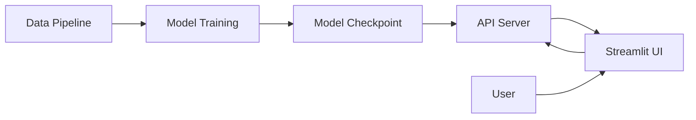

# Architecture Overview

This page provides a high-level overview of the MBTI Personality Classifier system architecture.

## System Components

The system consists of three main components:



### 1. Data Pipeline

**Location**: `src/mbti_classifier/data.py`

Handles all data-related operations:

- **Download**: Fetches MBTI dataset from Kaggle via `mlcroissant`
- **Preprocessing**: Cleans text, creates binary labels for 4 dimensions
- **Tokenization**: Converts text to DistilBERT-compatible tokens
- **Augmentation**: Random window sampling for sequences >512 tokens
- **Caching**: Saves processed data to avoid re-processing

**Key Classes**:
- `MBTIDataset`: PyTorch Dataset with tokenization
- `MBTIDataModule`: Lightning DataModule managing the full pipeline

### 2. Model Training

**Location**: `src/mbti_classifier/model.py`, `src/mbti_classifier/train.py`

Multi-task binary classification system:

**Architecture**:
```
DistilBERT Encoder (67M params)
        ↓
[CLS] Representation (768-dim)
        ↓
Shared Dense Layer (768 → 768)
        ↓
    ┌───┴───┬───┬───┐
    ↓       ↓   ↓   ↓
  E/I     S/N T/F J/P
  Head    Head Head Head
    ↓       ↓   ↓   ↓
 Logit   Logit Logit Logit
```

**Key Features**:
- 4 independent binary classifiers
- Shared representation layer
- BCE loss with optional pos_weight for class imbalance
- AdamW optimizer with linear warmup

### 3. API Server

**Location**: `src/mbti_classifier/api.py`

FastAPI server providing RESTful inference:

**Endpoints**:
- `GET /`: Service information
- `GET /health`: Health check (used by Docker)
- `POST /predict`: MBTI prediction from text

**Features**:
- Automatic model loading on startup
- Input validation with Pydantic
- CORS enabled for Streamlit UI
- Comprehensive error handling

### 4. Streamlit UI

**Location**: `src/mbti_classifier/ui.py`

Interactive web interface:

**Features**:
- Text input for prediction
- Real-time API calls
- Radar plot visualization of dimensions
- Probability scores display
- Responsive design

## Data Flow

### Training Pipeline

```
1. Raw Data (data/raw/mbti_1.csv)
   ↓
2. Preprocessing (clean text, binary labels)
   ↓
3. Cached Data (data/processed/processed_mbti.csv)
   ↓
4. Train/Val/Test Split (stratified)
   ↓
5. Tokenization (DistilBERT tokenizer)
   ↓
6. DataLoaders (batch_size=16, random windows)
   ↓
7. Model Training (Lightning Trainer)
   ↓
8. Checkpoint (models/best.ckpt)
```

### Inference Pipeline

```
1. User Text Input
   ↓
2. Text Cleaning (remove URLs, normalize)
   ↓
3. Tokenization (max_length=512)
   ↓
4. Model Forward Pass
   ↓
5. Sigmoid Activation (4 probabilities)
   ↓
6. Threshold (>0.5 = 1, else 0)
   ↓
7. MBTI Type Construction (e.g., "INTJ")
   ↓
8. Response (JSON with type + probabilities)
```

## Configuration Management

Uses Hydra for composable configs:

```
configs/
├── train.yaml              # Main config
├── train_quick.yaml        # Fast testing
├── train_cpu.yaml          # CPU-only
├── train_production.yaml   # Extended training
├── data/default.yaml       # DataModule settings
├── model/default.yaml      # Model hyperparameters
├── trainer/default.yaml    # Trainer options
├── callbacks/default.yaml  # Checkpoints, early stopping
└── logger/wandb.yaml       # Logging configuration
```

**Override pattern**:
```bash
python train.py model.learning_rate=5e-5 data.batch_size=32
```

## Docker Architecture

Three separate containers orchestrated with Docker Compose:

### Training Container

**Image**: `mbti-train:latest`

- **Purpose**: One-time model training
- **Base**: `python3.12-bookworm-slim`
- **Volumes**: `./models`, `./data`, `./configs`
- **Entrypoint**: `train.py`

### API Container

**Image**: `mbti-api:latest`

- **Purpose**: Inference server
- **Base**: `python3.12-bookworm-slim`
- **Port**: 8000
- **Volumes**: `./models` (read-only)
- **Health Check**: `curl http://localhost:8000/health`
- **Dependencies**: Build tools (g++) for PyTorch

### UI Container

**Image**: `mbti-ui:latest`

- **Purpose**: User interface
- **Base**: `python3.12-bookworm-slim`
- **Port**: 8501
- **Environment**: `API_URL=http://api:8000`
- **Depends On**: API (healthy)

**Inter-container Communication**:
- UI → API via internal Docker network
- Shared volumes for model persistence
- Health checks ensure startup order

## Data Versioning (DVC)

```
Git Repository
├── .dvc/config          # DVC configuration
├── data/raw.dvc         # Metadata (109 bytes)
├── data/processed.dvc   # Metadata
└── models.dvc           # Metadata

Google Cloud Storage (mlops70_bucket)
└── dvcstore/
    └── files/md5/
        ├── 34/...       # Raw data chunks
        ├── f3/...       # Model checkpoint (803 MB)
        └── ...
```

**Benefits**:
- Git tracks small metadata files
- GCS stores large binary files
- Content-addressable (deduplication)
- Checksum verification for integrity

## Scalability Considerations

### Horizontal Scaling

- **API**: Can run multiple instances behind load balancer
- **UI**: Stateless, easily replicated
- **Training**: Distributed with PyTorch Lightning (multi-GPU)

### Vertical Scaling

- **Training**: Supports GPU acceleration (CUDA)
- **API**: Can enable mixed-precision inference
- **Data**: Streaming for datasets larger than RAM

### Performance Optimization

- **Model**: DistilBERT (6x faster than BERT-base)
- **Caching**: Processed data cached to disk
- **Batching**: Configurable batch sizes
- **Workers**: Multi-process data loading

## Security

- **API**: Input validation with Pydantic
- **Docker**: Read-only model volumes in API
- **Credentials**: GCS auth via gcloud CLI (no keys in repo)
- **CORS**: Configurable allowed origins

## Monitoring

- **Training**: WandB integration for experiment tracking
- **API**: Health check endpoint
- **Logs**: Structured logging with loguru
- **Metrics**: Per-dimension F1 scores, accuracy, loss

## Next Steps

- Deep dive into [Data Pipeline](data-pipeline.md)
- Understand [Model Architecture](model.md)
- Explore [API & UI](api-ui.md)
